# Guide d'utilisation - Application de suivi des bouquetins ibériques V1

*Parc National des Pyrénées - rédigé par Emmanuel YEO, stagiaire développement*

## Sommaire

- [1. Page de connexion](#1-page-de-connexion)
- [2. Page Carte suivi GPS des individus](#2-page-carte-suivi-gps-des-individus)
  - [2.1 En-tête de l'application](#21-en-tête-de-lapplication)
  - [2.2 La sidebar de filtres](#22-la-sidebar-de-filtres)
  - [2.3 Positions ou Trajectoire](#23-positions-ou-trajectoire)
  - [2.4 Symbologie (couleur des points)](#24-symbologie-couleur-des-points)
  - [2.5 Fonds de carte et couches](#25-fonds-de-carte-et-couches)
  - [2.6 Barre d'outils de la carte](#26-barre-doutils-de-la-carte)
  - [2.7 Panneau de données](#27-panneau-de-données)
  - [2.8 Exporter les données](#28-exporter-les-données)
- [3. Page Individus - fiches et liste](#3-page-individus---fiches-et-liste)
  - [3.1 Filtres de la liste](#31-filtres-de-la-liste)
  - [3.2 Tableau de la liste](#32-tableau-de-la-liste)
  - [3.3 Fiche individuelle](#33-fiche-individuelle)
- [4. Page Statistiques - chiffres clés et graphiques](#4-page-statistiques---chiffres-clés-et-graphiques)
  - [4.1 Navigation](#41-navigation)
  - [4.2 Animaux déclarés](#42-animaux-déclarés)
  - [4.3 Animaux en cours de suivi](#43-animaux-en-cours-de-suivi)
  - [4.4 Animaux ayant été équipés](#44-animaux-ayant-été-équipés)
  - [4.5 Nombre de captures](#45-nombre-de-captures)
  - [4.6 Translocations](#46-translocations)

---

## 1. Page de connexion

L'écran de connexion est la première page affichée si vous n'êtes pas déjà connecté. Il se compose d'une photo de bouquetins à gauche et du formulaire de connexion à droite.

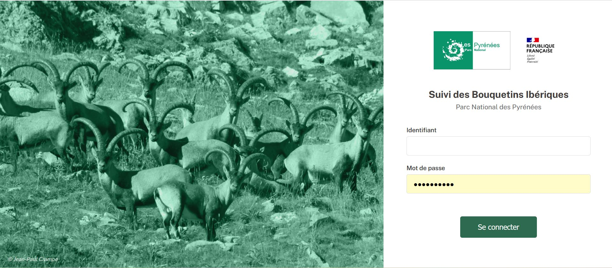

### Se connecter

- Renseignez votre Identifiant et votre Mot de passe dans les champs prévus **(Voir Ludovic)**
- Cliquez sur **Se connecter**.
- En cas d'erreur, le message *"Identifiants incorrects ou serveur inaccessible"* s'affiche. Ce message est volontairement générique et ne précise pas si l'erreur vient d'un mauvais mot de passe ou d'un problème de serveur.

> **⚠️ Bon à savoir**
> Une fois connecté, votre session reste active sur tous les onglets et pages du site. Inutile de vous reconnecter si vous ouvrez la page Individus ou Statistiques dans un nouvel onglet.

---

## 2. Page Carte suivi GPS des individus

La page Carte est la page principale de l'application : elle permet de visualiser les positions GPS des bouquetins équipés, de filtrer ces données selon de nombreux critères, et d'exporter les résultats.

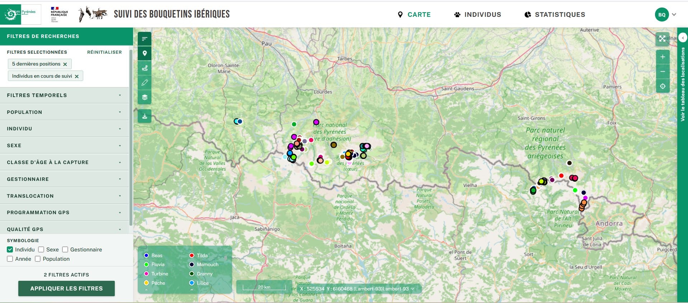

### 2.1 En-tête de l'application

- Les logos du Parc et de la République française, ainsi que le titre de l'application, sont affichés en permanence.
- La barre de navigation permet de basculer entre les 3 pages : Carte, Individus, Statistiques.
- En haut à droite, un menu affiche votre rôle et un bouton Se déconnecter.

> **⚠️ Déconnexion automatique**
> Sur les trois pages, une absence d'activité (souris, clavier, clic, défilement) pendant **30 minutes** entraîne une déconnexion automatique, dans le but de protéger les données de tous.

### 2.2 La sidebar de filtres

Chaque filtre appliqué apparaît sous forme d'étiquette (badge) cliquable dans la zone "Filtres actifs", en haut de la sidebar. Cliquer sur la croix d'une étiquette annule ce filtre précis. Les filtres sont regroupés en accordéons à dérouler.

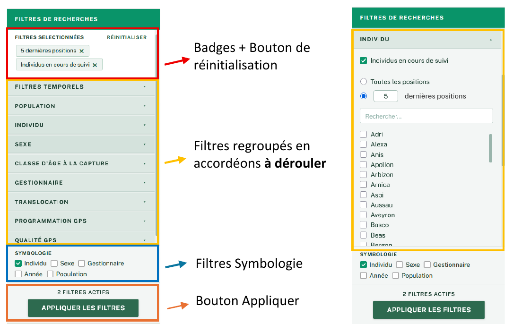

#### Filtres simples

| Élément | Description |
|---|---|
| Nom / recherche | Champ de recherche texte en direct sur la liste d'individus, en bas de la sidebar. |
| Sexe, Gestionnaire, Population, Programmation | Listes déroulantes à choix unique. |
| Translocation | Filtre selon que l'animal a été transloqué ou non. |
| Classe d'âge | Les classes proposées dépendent du Sexe sélectionné. Changer le Sexe peut réinitialiser silencieusement ce filtre si la classe choisie n'existe plus pour ce sexe. |
| Individus en cours de suivi | Case cochée par défaut : restreint aux animaux avec un collier actif. À décocher pour voir aussi les individus non suivis. |
| Inclure les outliers | Décochée par défaut : coche pour inclure les positions habituellement écartées car jugées aberrantes. |

> **⚠️ Bon à savoir**
> La liste des individus proposée dans le filtre de recherche se met automatiquement à jour dès qu'un autre filtre est appliqué, quel que soit ce filtre, avant même de cliquer sur Appliquer.

#### Filtres temporels - Période et Saison

> **⚠️ Attention**
> Les groupes "Période" (Du/Au) et "Saisonnalité" (Saison + Année) sont mutuellement exclusifs : dès qu'un des deux groupes est renseigné, l'autre se désactive visuellement. Choisir une Année après avoir rempli Du/Au n'aura aucun effet tant que Du/Au n'est pas vidé.

  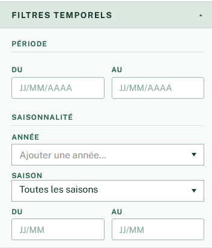
  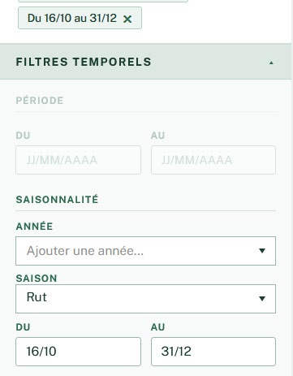

- **Période (Du / Au)** : deux champs de date au format JJ/MM/AAAA. Chaque champ génère sa propre étiquette, retirable indépendamment.
- **Saison** : liste déroulante (Hiver / Printemps / Été / Rut) qui pré-remplit deux champs jour/mois. Ces champs restent modifiables manuellement.
- **Année(s)** : sélection multiple, plusieurs années cumulables, avec une option "Toutes les années".
- Ces deux réglages sont combinables entre eux : une Saison seule (toutes années confondues), une ou plusieurs Années seules, ou une Saison restreinte à certaines Années.

#### Filtre spatial (dessin sur la carte)

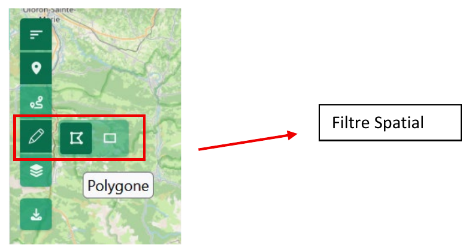

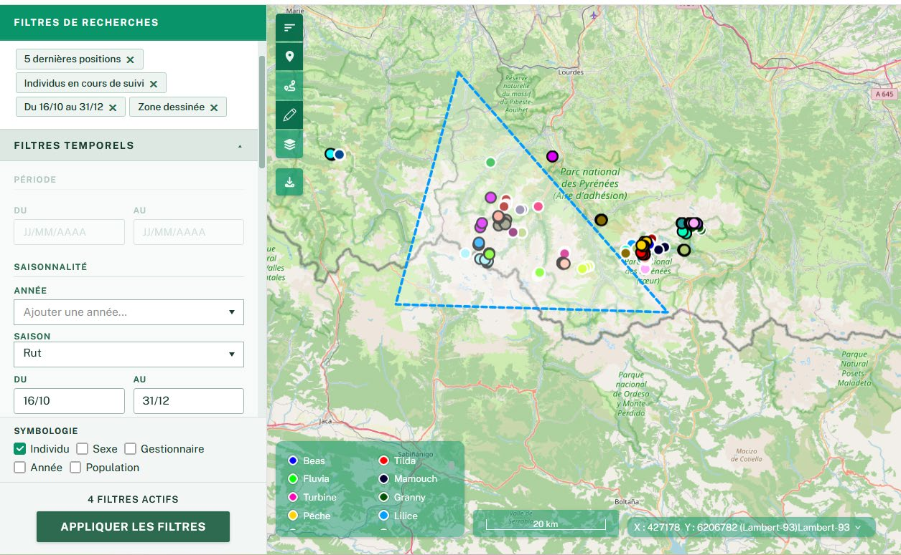

- Le bouton dédié dans la barre d'outils ouvre un choix Polygone ou Rectangle.
- Une fois une zone dessinée, elle devient un filtre actif (étiquette "Zone dessinée"), cumulable avec tous les autres filtres.
- Cliquer de nouveau sur le bouton alors qu'une zone est active la supprime directement.

#### Nombre de positions affichées

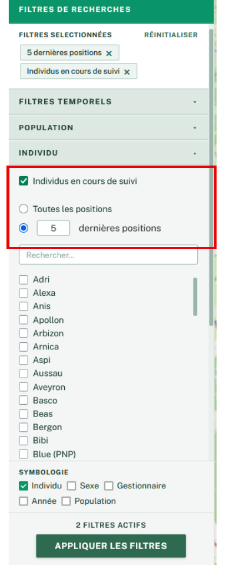

- Deux modes : "N dernières positions" (valeur numérique modifiable) ou "Toutes les positions".
- Le mode bascule automatiquement sur "Toutes" dès qu'un filtre est actif, sauf si vous avez déjà choisi un mode manuellement.

> **⚠️ Alerte volume**
> Si le nombre de positions à charger est très important, une fenêtre de confirmation s'affiche avant de lancer le chargement, pour éviter un ralentissement inutile.

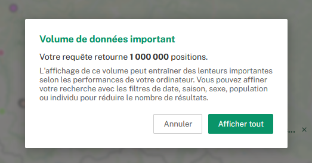

#### Appliquer et réinitialiser

- Le bouton **Appliquer les filtres** déclenche le rechargement de la carte et du panneau de données avec l'ensemble des filtres actifs.
- Le bouton **Réinitialiser** remet tous les filtres à leur état initial (individus en cours de suivi, mode Positions, 5 dernières positions).

### 2.3 Positions ou Trajectoire

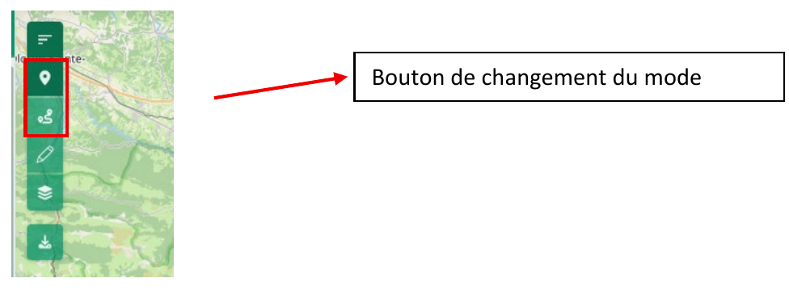

- Le mode **Positions** affiche un nuage de points.
- Le mode **Trajectoire** relie les positions dans l'ordre chronologique par animal, avec un marquage du point de départ et du point le plus récent, et des flèches de direction sur les longs segments.
- Le bouton Trajectoire est grisé (indisponible) tant qu'un individu n'a pas au moins 2 positions à afficher.

### 2.4 Symbologie (couleur des points)

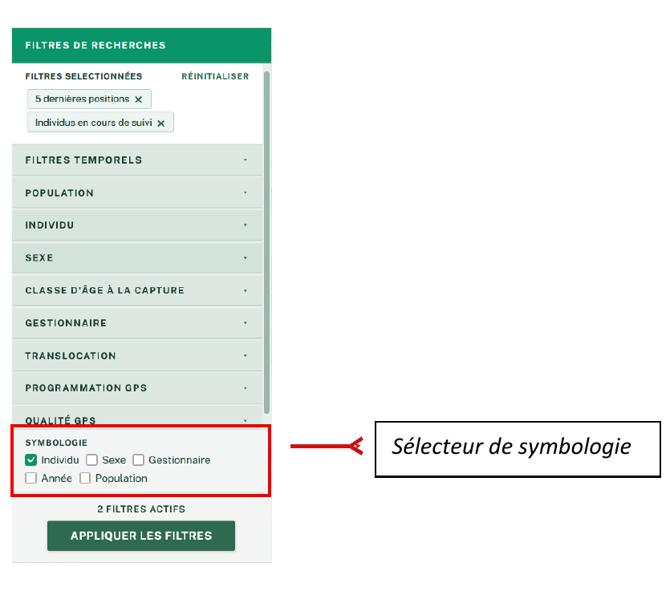

Cinq modes de coloration, appliqués instantanément sans recharger les données :

- **Individu** : une couleur distincte par animal.
- **Sexe** : bleu (mâle), rose (femelle), gris (non renseigné).
- **Gestionnaire** : vert (PNP), orange (PNRPA), gris (non renseigné).
- **Population** : une couleur par population.
- **Année** : une couleur par année de la position.

La légende, dans un panneau repliable, se met à jour avec le mode choisi.

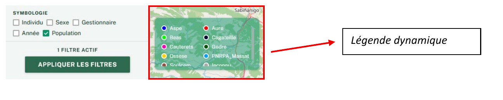

### 2.5 Fonds de carte et couches

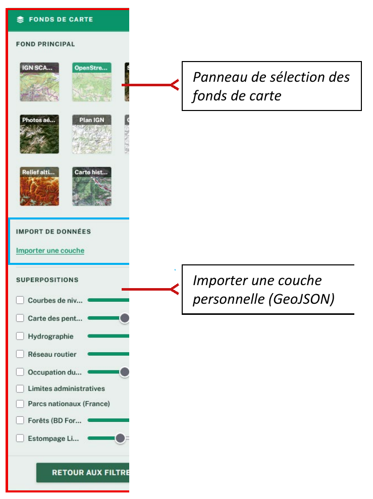

- **8 fonds de carte** disponibles (IGN Scan25, OpenStreetMap, Satellite, IGN Ortho/Topo/Relief/Relief+pentes, IGN Scan50), un seul actif à la fois.
- **9 surcouches** cumulables (contours, pentes, hydrographie, routes, occupation du sol, limites administratives, parcs nationaux, forêts, Lidar HD), chacune avec case à cocher et curseur d'opacité.

#### Importer une couche personnelle (GeoJSON)

- Le bouton "Importer un fichier" permet d'ajouter une couche GeoJSON personnelle sur la carte.
- Plusieurs couches peuvent être importées simultanément ; chacune reçoit une couleur différente et dispose de sa propre case à cocher, curseur d'opacité et bouton de suppression.
- Un message d'erreur explicite s'affiche si le fichier est illisible ou mal formé.

### 2.6 Barre d'outils de la carte

  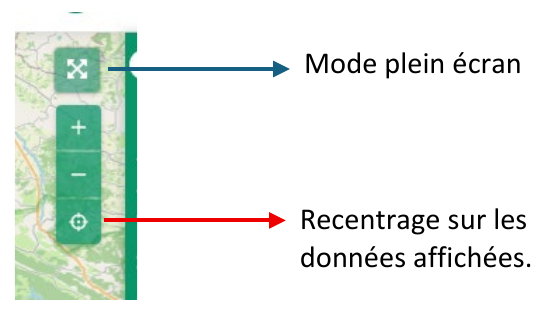
  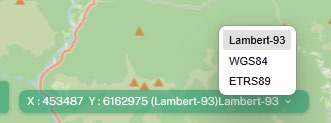

- Zoom avant / arrière
- Mode plein écran
- Recentrage sur les données affichées
- Affichage des coordonnées du curseur, avec un choix de système de projection (Lambert-93, WGS84, ETRS89)
- Utilisez le double-clic ou les boutons +/- pour zoomer, ou la molette de la souris

### 2.7 Panneau de données

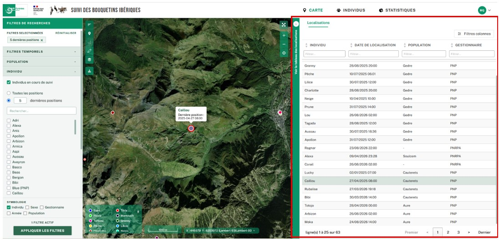

- Deux onglets : **Données** (tableau des positions) et **Individus** (liste des individus affichés).
- Colonnes activables : identifiant, sexe, altitude, température, précision (DOP).
- Tri ou filtre par colonne et pagination (25 lignes par page).
- Cliquer une ligne du tableau met en surbrillance le point correspondant sur la carte, et inversement.

> **⚠️ Important**
> Le filtrage effectué dans les colonnes du tableau s'applique également aux points affichés sur la carte. Par exemple, en sélectionnant « Cauterets » dans la colonne *Population*, seuls les individus appartenant à cette population restent affichés dans le tableau et sur la carte. Les autres individus sont automatiquement masqués.

### 2.8 Exporter les données

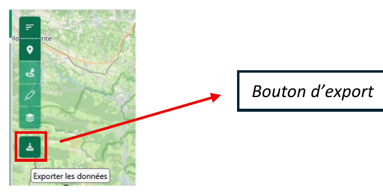

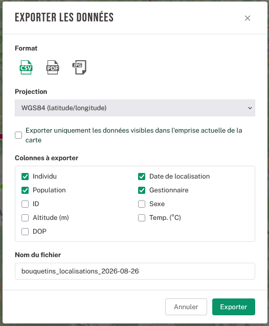

| Format | Contenu |
|---|---|
| **CSV** | Choix des colonnes et de la projection des coordonnées. Option pour n'exporter que les données visibles dans la zone actuellement affichée à l'écran. |
| **PDF** | Rapport A4 avec logo, résumé des filtres actifs, capture de la carte et légende (limitée aux éléments visibles à l'écran). |
| **JPG** | Image de la carte avec le même habillage que le PDF (logo, résumé, légende). |

> **⚠️ Limites techniques**
> Certains fonds de carte externes (notamment satellite) peuvent empêcher l'export pour des raisons de sécurité du navigateur. Un message invite alors à changer de fond de carte avant de réessayer.

> **⚠️ Bon à savoir**
> En cochant l'option « Exporter uniquement les données visibles dans l'emprise actuelle de la carte » (format CSV), seules les positions actuellement affichées à l'écran après un zoom ou un déplacement de la carte seront exportées.

---

## 3. Page Individus - fiches et liste

Cette page permet de consulter la liste complète des individus enregistrés et d'accéder à la fiche détaillée de chacun.

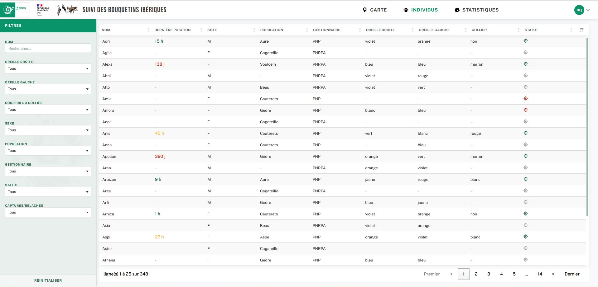

### 3.1 Filtres de la liste

Tous les filtres sont cumulables et s'appliquent immédiatement, sans bouton "Appliquer".

| Élément | Description |
|---|---|
| Nom | Recherche texte. |
| Oreille droite / gauche, Couleur du collier, Sexe, Population, Gestionnaire | Listes déroulantes peuplées à partir des valeurs réellement présentes en base. |
| Statut | Tous / Suivi actif / Non suivi / Mort. |
| Captures / Relâchés | Nombre exact d'événements (0, 1, 2) ou 3 et plus. |

- Le bouton **Réinitialiser** vide l'ensemble des filtres d'un coup.

### 3.2 Tableau de la liste

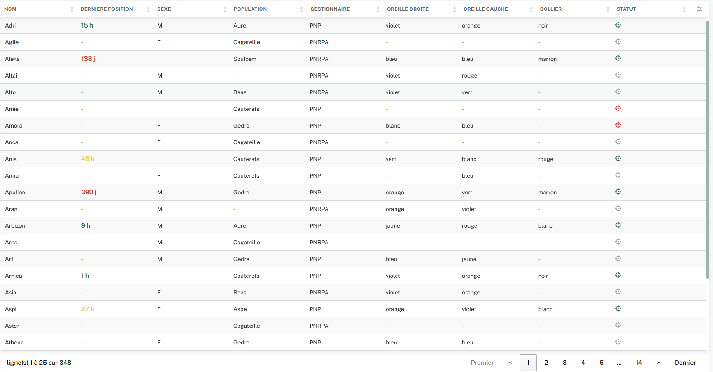

- Colonnes affichées par défaut : Dernière position, Sexe, Population, Gestionnaire, Oreille droite/gauche, Collier, Statut. D'autres colonnes sont activables (nom, identifiant, année de naissance).
- Statut :
  -  Suivi actif
  -  Non suivi actuellement ou jamais été équipé (suivi)
  -  Mort
- La colonne "Dernière position" n'affiche une valeur que pour les individus au statut actif ; un code couleur indique l'ancienneté de la position (jaune, orange, rouge selon le délai).

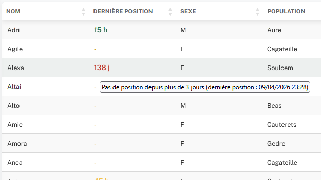

- Toutes les colonnes sont triables ; pagination à 25 lignes par page.
- Cliquer sur une ligne ouvre la fiche détaillée de l'individu.

### 3.3 Fiche individuelle

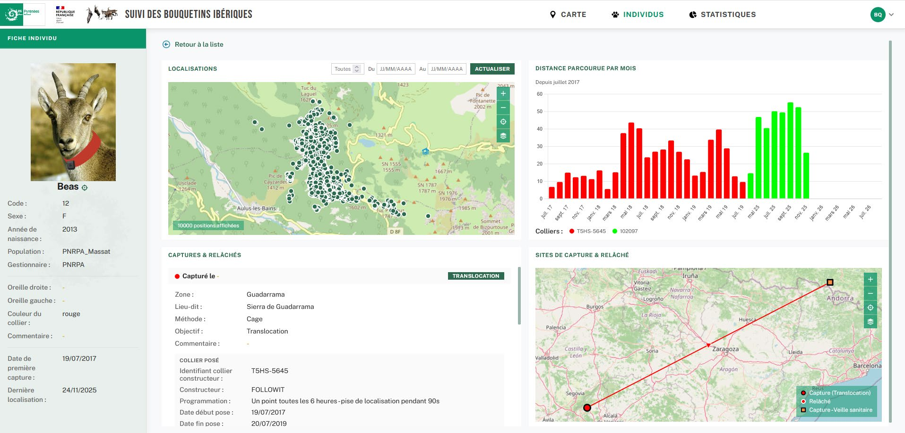

Le bouton "Retour à la liste" en haut de la fiche restaure la liste et les filtres précédemment consultés.

#### Carte d'identité (sidebar)

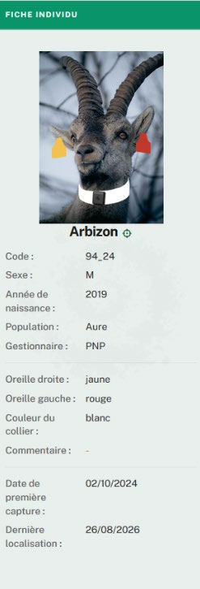

- Photo de l'animal, illustration du collier et des marques d'oreille aux couleurs réelles.
- Informations d'identité (code, sexe, année de naissance, population, gestionnaire), de marquage, et dates clés (première capture, dernière localisation).

#### Localisations (carte)

> **⚠️ Important**
> Ce bloc n'est PAS mis à jour en temps réel : après avoir modifié le nombre de positions ou les dates, il faut cliquer sur le bouton **Actualiser** pour voir le résultat.

- Filtres propres à ce bloc : nombre de positions (laisser vide pour tout afficher) et une période Du/Au.
- Cliquer sur un point affiche sa date et son altitude.

#### Distance parcourue par mois

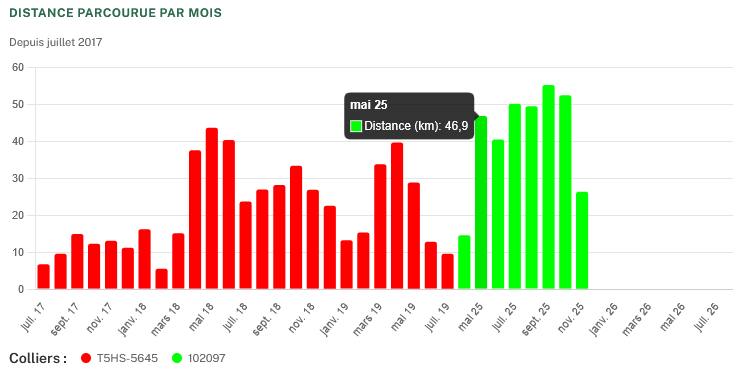

- Graphique en barres, un mois par barre, uniquement pour les mois où un collier était actif.
- Si l'animal a eu plusieurs colliers successifs, chaque collier a sa propre couleur dans le graphique (voir la légende associée).

#### Captures & Relâchés

- Liste chronologique de chaque événement : date, zone, lieu-dit, méthode, objectif, commentaire.
- Un événement de translocation est signalé par un badge dédié et affiche en plus les informations du site de relâché.

#### Sites de capture & relâché (carte)

  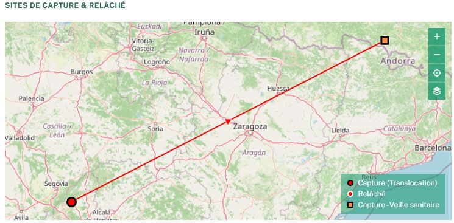
  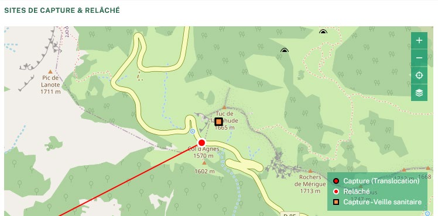

- Les captures classiques apparaissent en carré, colorées selon l'objectif de capture.
- Les translocations apparaissent en rond, avec le site de départ et le site d'arrivée reliés.
- La légende est cliquable : cliquer une entrée zoome directement sur les points correspondants.

---

## 4. Page Statistiques - chiffres clés et graphiques

Cette page présente des indicateurs globaux sur la population de bouquetins suivie, organisés en 5 vues accessibles depuis un menu de navigation à gauche.

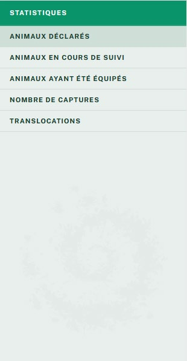

### 4.1 Navigation

- Une seule vue est affichée à la fois : Animaux déclarés, Animaux en cours de suivi, Animaux ayant été équipés, Nombre de captures, Translocations.
- Chaque vue présente un grand chiffre total, jusqu'à 3 camemberts (Sexe, Population, Gestionnaire), et une note explicative précisant la définition exacte du chiffre affiché.

### 4.2 Animaux déclarés

- Tous les animaux enregistrés dans la base, qu'ils soient équipés ou non. Aucun filtre par année.

### 4.3 Animaux en cours de suivi

- Animaux actuellement équipés d'un collier GPS actif. Aucun filtre par année.

### 4.4 Animaux ayant été équipés

- Tout animal ayant eu un collier posé un jour, que ce collier soit encore actif ou non aujourd'hui.
- Filtre par année disponible, basé sur la date de pose du collier.

### 4.5 Nombre de captures

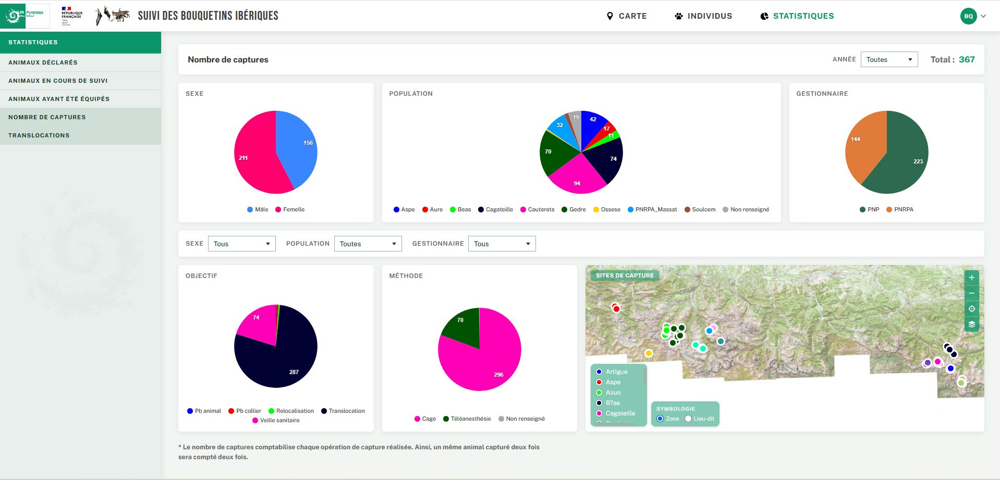

> **⚠️ Point important**
> Ce chiffre compte les opérations de capture, pas les individus distincts : un animal capturé deux fois est comptabilisé deux fois. Les translocations sont incluses (une translocation est aussi une capture).

- Filtre par année disponible.
- Deux camemberts supplémentaires, **Objectif** et **Méthode** de capture, disposent de leurs propres sous-filtres (Sexe, Population, Gestionnaire).

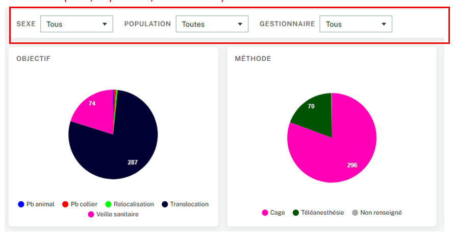

> **⚠️ Attention**
> Ces 3 sous-filtres n'affectent QUE les camemberts Objectif et Méthode. Ils n'ont aucun effet sur le grand chiffre total ni sur les camemberts Sexe/Population/Gestionnaire du haut de page - ce n'est pas une anomalie.

- Une carte affiche les sites de capture, avec un choix d'affichage par Zone ou par Lieu-dit.

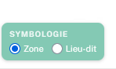

### 4.6 Translocations

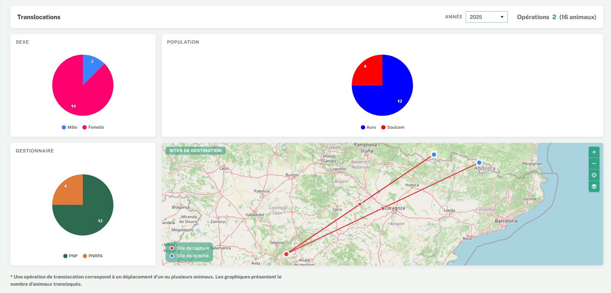

- Le grand chiffre affiche à la fois le nombre d'opérations de translocation et, entre parenthèses, le nombre d'animaux concernés (une opération peut déplacer plusieurs animaux le même jour).
- Les camemberts comptent les animaux transloqués, pas les opérations.
- Filtre par année disponible, basé sur la date de relâche.
- Une carte affiche les sites de destination des translocations.
